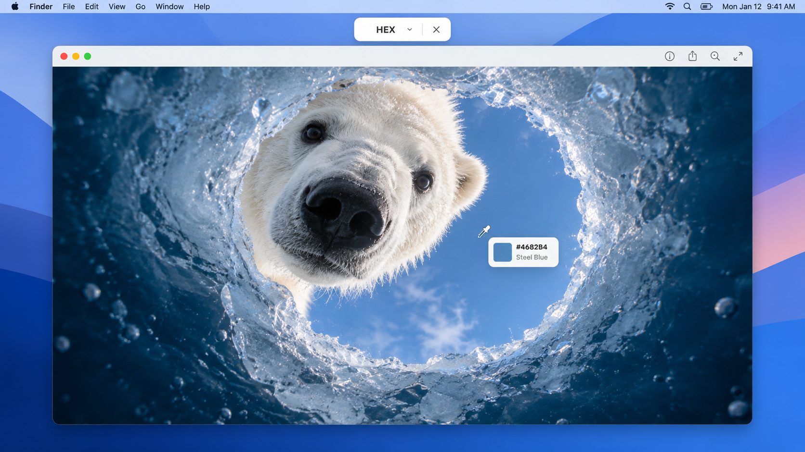
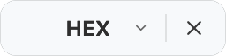
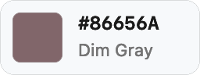

#  Rangoli

**Pick a color anywhere on your Mac.** Rangoli lives in the menu bar and copies the color under your cursor in one click.

I loved the beautiful, effortless feel of the Windows color picker and wanted that same little moment on macOS. Rangoli is my take: a tiny eyedropper, a live color preview, and a shortcut that gets out of your way as soon as you have the color you need.



*An illustrative desktop mockup inspired by “Icy Window” by Audun Rikardsen.*

## A closer look

| Pick your format | See the color before you copy |
|:---:|:---:|
|  | 

The Settings popover keeps the two things you may want to change close at hand: your shortcut and whether Rangoli starts at login.

## What it does

- Open Rangoli or press **Control–Option–C**. Move over any pixel; left click to copy its code and close.
- Switch between Hex, RGB, HSL, HSV, CMYK, and Lab from the small bar at the top of the primary display. Rangoli remembers your last choice.
- See a swatch, the current code, and the nearest name from the [CSS named-color list](https://www.w3.org/TR/css-color-4/#named-colors) next to your cursor. Click to copy to your clipboard.
- To exit, right click, press Esc, click X, or press the shortcut again.

## Download and install

**macOS 14 or later · Apple Silicon (M1 or newer)**

[Download Rangoli for Mac](https://github.com/desigrit/rangoli-picker/releases/latest/download/Rangoli-macOS-arm64.zip) · [View the latest release](https://github.com/desigrit/rangoli-picker/releases/latest) · [SHA-256 checksum](https://github.com/desigrit/rangoli-picker/releases/latest/download/SHA256SUMS.txt)

1. Unzip the download and move `Rangoli.app` to **Applications**, or double click Rangoli.
2. MacOS may block it on first launch. After that first attempt, open **System Settings → Privacy & Security**, find Rangoli near the bottom, and choose **Open Anyway**. [Apple explains this step here](https://support.apple.com/guide/mac-help/open-a-mac-app-from-an-unknown-developer-mh40616/mac).
3. Allow **Screen & System Audio Recording** when macOS asks. Rangoli needs it to read the pixel under your cursor while picking. If picking still cannot start, quit and reopen the app, then choose **Pick** from its menu bar icon.

Move the app to its final location before granting screen access or enabling Launch at Login. Opening Rangoli starts the picker; once you dismiss it, Rangoli stays in the menu bar for your shortcut.

## A few details

- Rangoli samples at native display resolution and converts the result to sRGB before formatting it.
- Color names are the nearest of the 148 opaque CSS named colors. They are descriptive approximations, not exact matches for every screen color.
- CMYK is an approximation of an sRGB screen color; it is not a print profile conversion. Lab uses a D50 white point.

## Build from source

Rangoli is written in Swift and AppKit with no third-party dependencies. With the Apple Command Line Tools installed, run `zsh Scripts/build-app.sh` from this repository to produce `dist/Rangoli.app`. The script runs color and coordinate checks before packaging. A local rebuild changes the default ad hoc signature, so macOS may ask you to refresh screen access. You can supply a stable signing identity with `RANG_CODESIGN_IDENTITY`.

After granting screen access, you can run the live sampling check:

```sh
dist/Rangoli.app/Contents/MacOS/Rangoli --check-sampling .build/sampling-check.json
```

That check samples foreground colors and a single Retina pixel, verifies that Rangoli's own panels are excluded, and exercises cursor restoration. The full implementation is in [`Sources/`](Sources/); the icon generator is [`Scripts/generate-icon.swift`](Scripts/generate-icon.swift).
